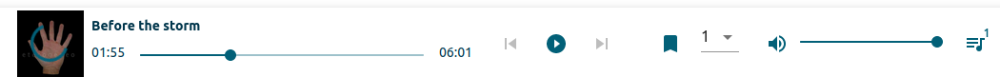

# Material-UI-Audio-Player

## Preview

This component is intended to complement the Material UI Framework providing audio Player functionality.

For an extensive example of this package's usage see https://github.com/Kevinwochan/Ultracast, my capstone university project.
